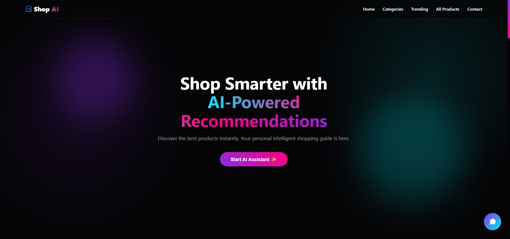
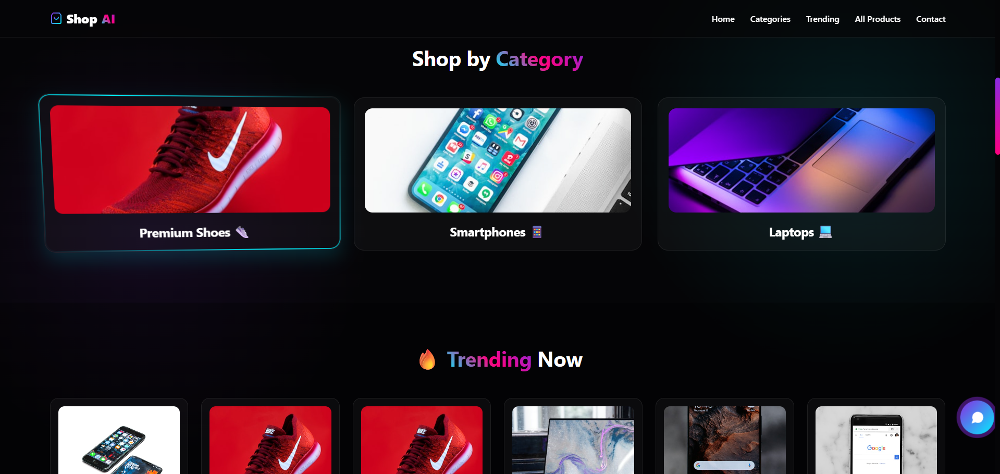
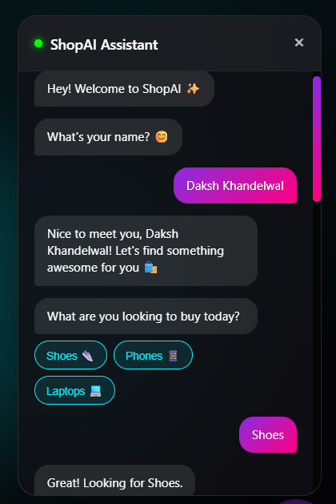
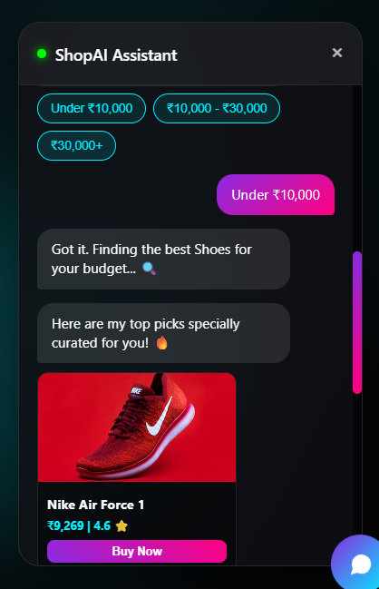

# 🛍️ Mini E-commerce Product Guide Bot

> 🚀 An AI-powered E-commerce Product Guide Bot with a modern, animated UI that helps users discover products based on category and budget.

---

## 🌐 Live Demo

👉 [Click to Explore the Website](https://mini-e-commerce-product-guide-bot.vercel.app/)

---

## 📌 Overview

Mini E-commerce Product Guide Bot is a **smart interactive shopping assistant** designed to simplify product discovery using AI-driven conversations.

It combines a **futuristic UI, chatbot intelligence, and dynamic product recommendations** to create a seamless shopping experience.

> 🎯 Designed to make online shopping faster, smarter, and more personalized.

---

## ✨ Features

* 🤖 AI Chatbot Product Assistant
* 🎯 Category-Based Product Recommendations
* 💰 Budget-Based Filtering System
* 🛍️ Dynamic Product Cards with Images
* 🎨 Modern Glassmorphism + Neon UI
* ⚡ Smooth Animations & 3D Effects
* 📊 Smart Product Dataset (70+ items) fileciteturn3file0
* 📱 Fully Responsive Design

---

## 🧠 How It Works

The chatbot follows an intelligent **decision-based flow**:

1. 👤 Ask user name
2. 🛍️ Select product category
3. 💰 Choose budget range
4. 🔍 Filter products dynamically
5. 🎯 Recommend top 3 products

---

## 💡 User Flow

1. User clicks **"Start AI Assistant"** ✨
2. Chatbot asks for preferences
3. User selects category & budget
4. System analyzes product dataset
5. 🎯 Displays best recommendations

---

## 🛠️ Tech Stack

* **Frontend:** HTML5, CSS3, JavaScript
* **UI Design:** Glassmorphism + Neon Effects
* **Animations:** CSS + JS
* **Logic:** Vanilla JS State Machine
* **Icons:** Font Awesome
* **Fonts:** System Fonts + Modern UI
* **Deployment:** Vercel

---

## 📂 Project Structure

```
📁 Mini-E-commerce-Product-Guide-Bot
│── README.md
│── index.html
│── screenshot_1.png
│── screenshot_2.png
│── screenshot_3.png
│── screenshot_4.png
```

---

## 🚀 Getting Started

### 1️⃣ Clone the Repository

```bash
git clone https://github.com/dk-khandelwal06/Mini-E-commerce-Product-Guide-Bot.git
```

### 2️⃣ Open the Project

Simply open:

```bash
index.html
```

✅ No installation required
✅ No dependencies

---

## 📸 Screenshots

### 🔥 Main Interface



---

### 🛍️ Product Experience



---

### 🤖 Chatbot Interaction

<p align="center">
  
  
</p>

---

## 🔮 Future Enhancements

* 🤖 Real AI Recommendation Model
* 🛒 Cart & Checkout System
* 📊 Personalized Recommendations
* 🌐 Backend Integration (Node.js / Python)
* 🔐 User Authentication

---

## 🤝 Acknowledgements

💡 Built as part of experimentation with AI-driven interfaces and smart UI design.

---

## 📬 Connect with Me

**Daksh Khandelwal**  
1st Year BS in AI & Data Science @ IIT Jodhpur  
📧 dk.khandelwaliitj@gmail.com  
🔗 [LinkedIn Profile](https://www.linkedin.com/in/daksh-khandelwal-b02748391/)
